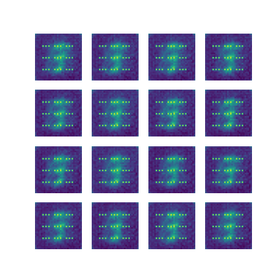
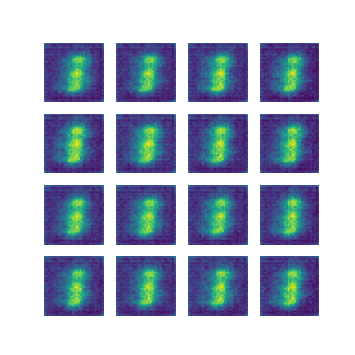

See [FiLM: Visual Reasoning with a General Conditioning Layer](https://arxiv.org/pdf/1709.07871.pdf) for details regarding FiLM and [Improved Training of Wasserstein GANs](https://arxiv.org/pdf/1704.00028.pdf) for details regarding Conditioned WGAN-GP

## Training       
```                                                                                                          
 python main.py --dataset mnist --use_FiLM
``` 

## Acknowledgements

I used the following resource for reference:
[Improved Training of Wasserstein GANs](https://distill.pub/2018/feature-wise-transformations/)

## Results
Gifs created from images saved during training:


without FiLM Layers



with FiLM Layers



These gifs are creates using code taken from 
[DCGAN Tutorial](https://www.tensorflow.org/tutorials/generative/dcgan#create_a_gif)
